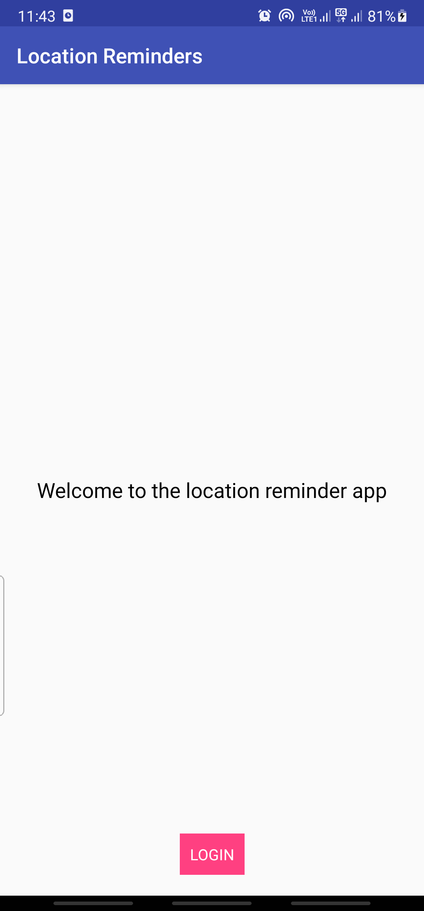
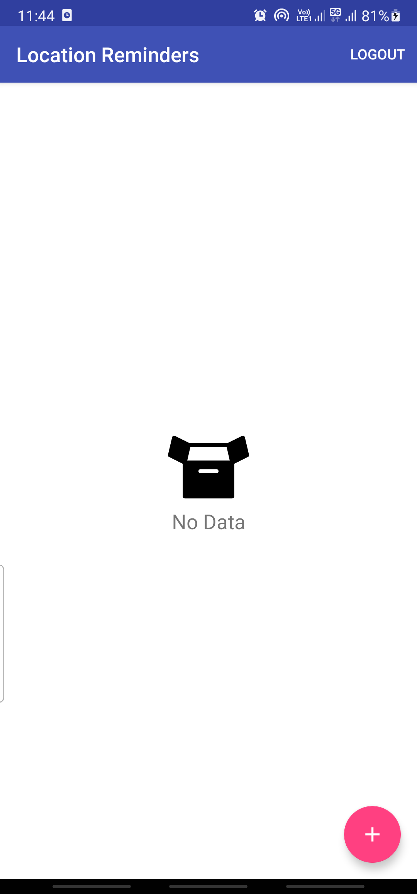
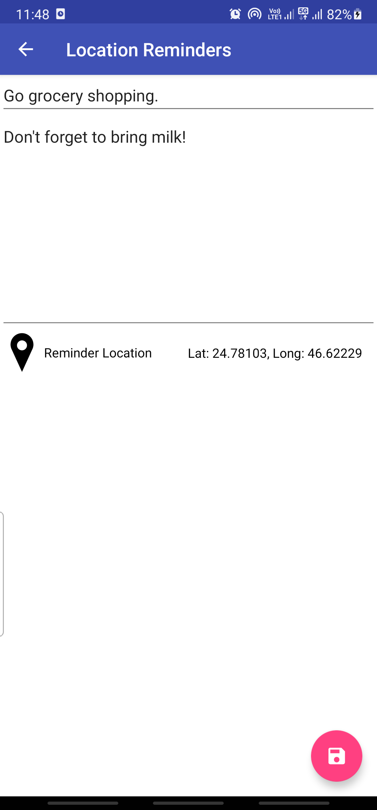
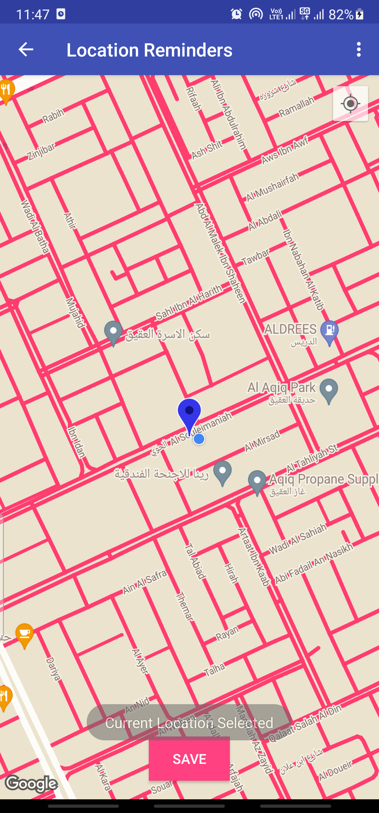
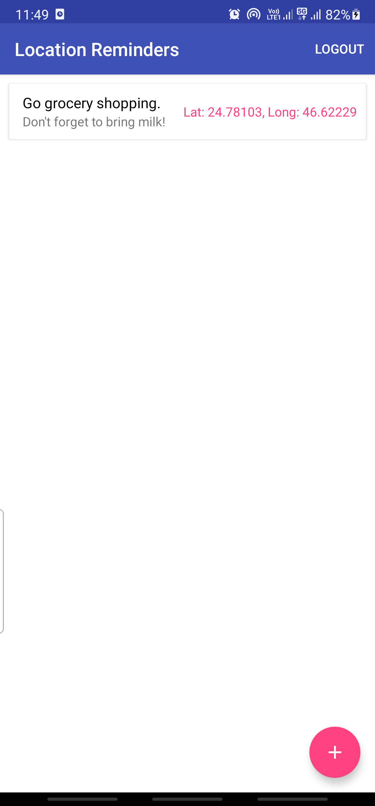
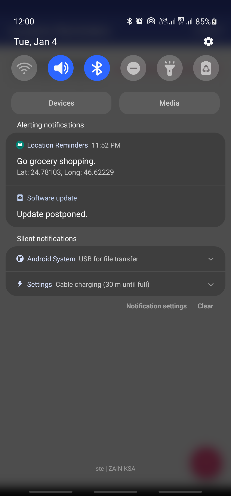

## Location-Reminder

Location-Reminder is an Android To-do list application written in Kotlin with location reminders that remind the user to do something when he reaches a specific location.

Location-Reminder is an application built to demonstrate core Kotlin and Android Development skills.

This app utilizes the following libraries:

* [Google Maps](https://developers.google.com/maps/documentation/android-sdk/overview) to display and interact with maps.
* [Firebase Authentication](https://firebase.google.com/docs/auth) to perform user authentication operations.
* [Geofencing](https://developers.google.com/location-context/geofencing) to trigger an action when a device enters a set location.
* [Room](https://developer.android.com/training/data-storage/room) for local database storage.
* [Coroutines](https://kotlinlang.org/docs/coroutines-overview.html) for background-threading.
  
It leverages the following components from the Jetpack library:

* [ViewModel](https://developer.android.com/topic/libraries/architecture/viewmodel).
* [RecyclerView](https://developer.android.com/jetpack/androidx/releases/recyclerview).
* [LiveData](https://developer.android.com/topic/libraries/architecture/livedata).
* [Data Binding](https://developer.android.com/topic/libraries/data-binding/) with binding adapters.
* [Navigation](https://developer.android.com/topic/libraries/architecture/navigation/) with the SafeArgs plugin for parameter passing between fragments.

## Screenshots

  <table>
  <tr>
    <td></td>
    <td></td>
    <td></td>
  </tr>
<tr>
    <td></td>
    <td></td>
    <td></td>

</tr>
 </table>